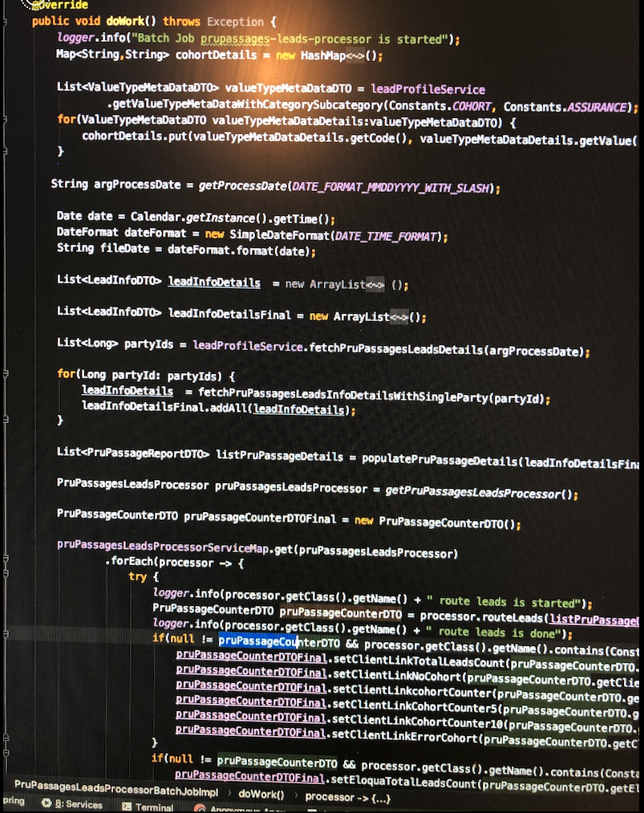

## Use method Chaining to do the service layering

### 1. Following is a part of an example of normal coding from most developers
The purpose of this doWork logic here is:
1. load a file from a landing server
2. validate the records
3. load leads and into a lead list
4. archive and delete this loaded file



### 2. And here is my code for doing the same business logic but for a different file

```Java
    @Override
    public void doWork() throws Exception {
        logger.info("Batch Job gi-files-load is started");

        try {
            giFileService
                    .getGIFilesFromLandingServer()
                    .validateNumOfRecords()
                    .createLeadList(giFileService.loadLeads())
                    .archiveAndDeleteGIFiles();

        } catch (Exception e) {
            logger.error(e.toString());

        } finally {
            // send email giFilesLoadMetricReport
            giFilesLoadMetricReportService.sendEmail(giFilesLoadMetricReport);
        }

        logger.info("Batch Job gi-files-load is done");
    }
```